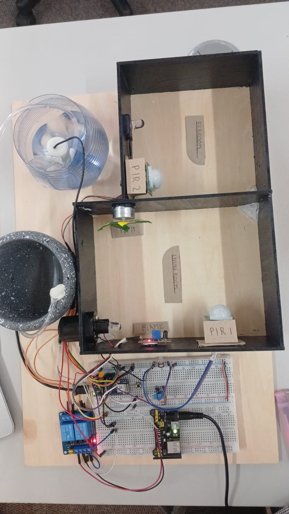
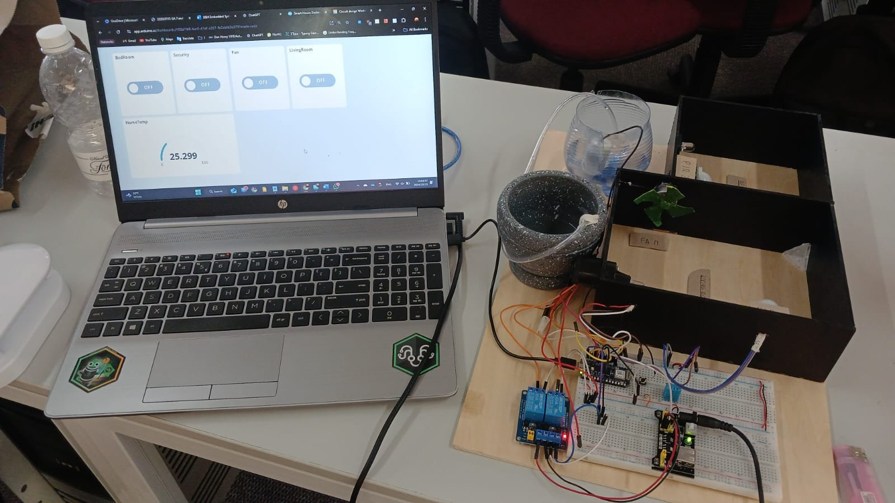
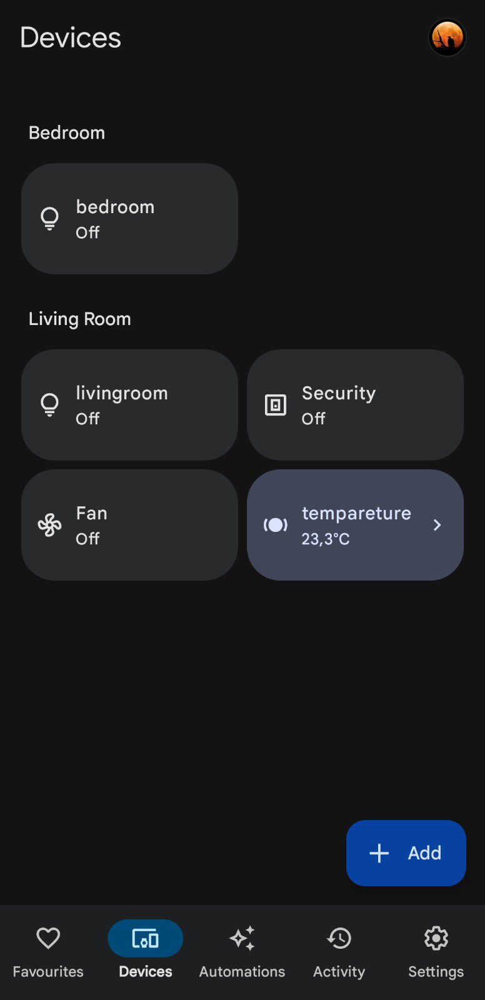
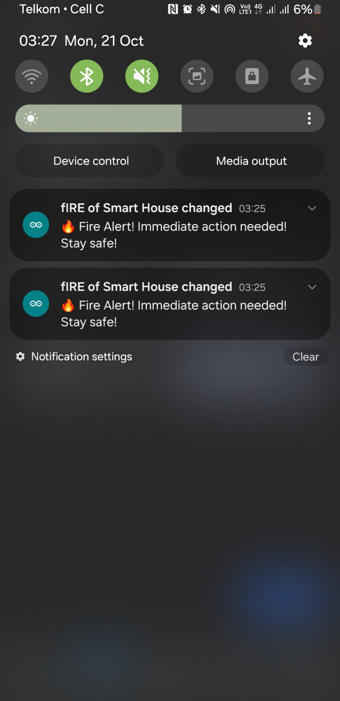

# SmartHomeAutomation

A budget-friendly IoT smart home prototype designed for **South African households**, addressing load shedding, home security, fire safety, and climate control.

---

## Authors

| Name | GitHub |
|---|---|
| Inga Asanda Gogela | [@IGMT1112](https://github.com/IGMT1112) |
| Alphios Junior | [@Alphiosjunior](https://github.com/Alphiosjunior) |

**Institution:** Cape Peninsula University of Technology (CPUT)  
**Module:** Industrial Computing Design Project 3 (DES371S)  
**Supervisor:** Dr Ali Almaktoof  
**Date:** October 2024

---

## Project Photos

**Physical Prototype**





**Google Home Integration**



**Fire Alert Notification**



---

## Overview

This project presents a smart home automation system built on the **Arduino Nano RP2040** microcontroller, integrated with **Arduino Cloud IoT** and **Google Home**. It provides remote monitoring and control of key household systems through an affordable, modular IoT solution.

### Problems Addressed

- **Load shedding** — automatic power switching between municipal and backup sources
- **Home security** — motion-activated alarm with remote arm/disarm
- **Fire safety** — automatic flame detection and water pump suppression
- **Climate control** — temperature-based fan automation
- **Lighting efficiency** — motion-triggered lights to reduce electricity waste

---

## Hardware Components

| Component | Purpose | Cost (ZAR) |
|---|---|---|
| Arduino Nano RP2040 | Main microcontroller | R500 |
| Arduino Cloud subscription | Remote IoT connectivity | R130 |
| PIR Motion Sensors (x2) | Bedroom & lounge detection | R100 |
| DHT11 Sensor | Temperature & humidity monitoring | R40 |
| Flame Sensor Module | Fire detection | R20 |
| 5V Buzzer | Security & fire alarm | R40 |
| Two-channel Relay | Power & actuator switching | R60 |
| Water Pump | Simulated fire suppression | R95 |
| LEDs | Room lights & status indicators | R4 |
| **Total** | | **~R1,000** |

---

## System Features

### Lighting Automation
PIR sensors in the bedroom and lounge control room LEDs based on occupancy. Lights turn on when motion is detected and off when the room is empty. Manual override is available via the Arduino Cloud dashboard.

### Climate Control
The DHT11 sensor continuously monitors ambient temperature. The fan (DC motor via relay) activates automatically when temperature exceeds 30°C. Manual override via the cloud dashboard disables auto mode.

### Security System
Armed and disarmed via a physical button, the cloud dashboard, or a Google Home voice command. When armed, motion detected by either PIR sensor triggers the buzzer and sends a push notification to the user.

### Fire Detection and Suppression
The flame sensor continuously monitors for fire. On detection, the buzzer sounds, the water pump activates, and a push notification is sent. The pump turns off automatically once the flame is no longer detected.

### Power Management
A relay automatically switches between municipal power and a backup source during outages.

---

## Remote Operation

| Platform | Capability |
|---|---|
| Arduino Cloud | Real-time sensor dashboard, remote light/fan/security control, push notifications |
| Google Home | Voice commands to arm/disarm, toggle lights, control climate |

---

## Project Structure

```
SmartHomeAutomation/
├── SmartHomeAutomation.ino   # Main Arduino sketch
└── README.md                 # Project documentation
```

> **Note:** `thingProperties.h` is auto-generated by Arduino Cloud when you set up your Thing. Create a Thing on [Arduino Cloud](https://cloud.arduino.cc) with the following variables:
> - `tempareture` (float, read-only)
> - `bedroom` (bool, read-write)
> - `livingroom` (bool, read-write)
> - `climateControl` (bool, read-write)
> - `sercurityArm` (bool, read-write)
> - `fIRE` (bool, read-only)
> - `iNTRUDER` (bool, read-only)
> - `buttonPressed` (bool, read-write)
> - `systemArmed` (bool, read-write)
> - `motionBedroom` (bool, read-only)
> - `motionLounge` (bool, read-only)

---

## Pin Configuration

| Pin | Component |
|---|---|
| 2 | Flame Sensor |
| 3 | PIR Sensor (Bedroom) |
| 4 | PIR Sensor (Lounge) |
| 5 | DHT11 Data |
| 6 | Fan (via relay) |
| 7 | Button (arm/disarm) |
| 8 | Security/Alert LED |
| 9 | Bedroom LED |
| 10 | Lounge LED |
| 11 | Water Pump (via relay) |

---

## Getting Started

1. Clone this repository
   ```bash
   git clone https://github.com/Alphiosjunior/SmartHomeAutomation.git
   ```

2. Set up Arduino Cloud — create a free account at [cloud.arduino.cc](https://cloud.arduino.cc), create a new Thing, and add the cloud variables listed above. Download the auto-generated `thingProperties.h` and place it in the same folder as the `.ino` file.

3. Install the following libraries via the Arduino IDE Library Manager:
   - `DHT sensor library` by Adafruit
   - `ArduinoIoTCloud`
   - `Arduino_ConnectionHandler`

4. Upload the sketch to your Arduino Nano RP2040.

5. Connect Google Home via the Arduino skill in the Google Home app.

---

## References

- Kleinman Center for Energy Policy (2023). *Shedding the Load: Power Shortages Widen Divides in South Africa*
- Africa Sustainability Matters (2023). *Load shedding in South Africa: Unintended consequences*
- Bystrom, M. & Eisenstein, B. (2005). *Practical Engineering Design*. CRC Press
- ECSA Code of Ethics: [ecsa.co.za](https://www.ecsa.co.za)

---

## License

This project was developed for academic purposes at CPUT. Feel free to use it as a reference for your own IoT projects.
